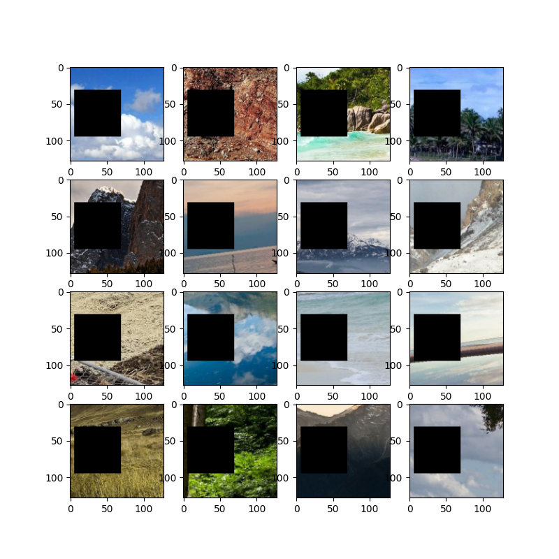
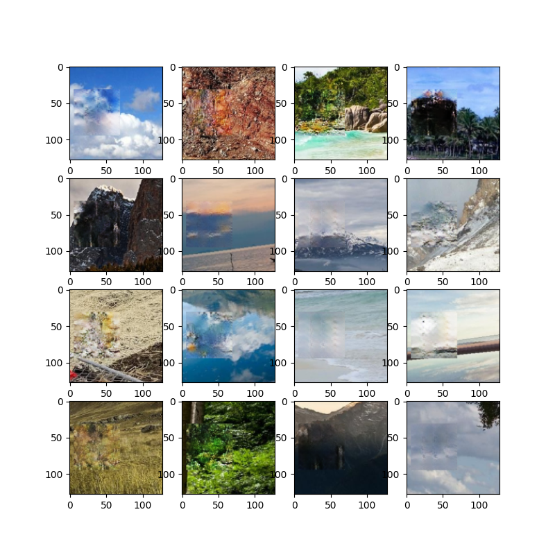
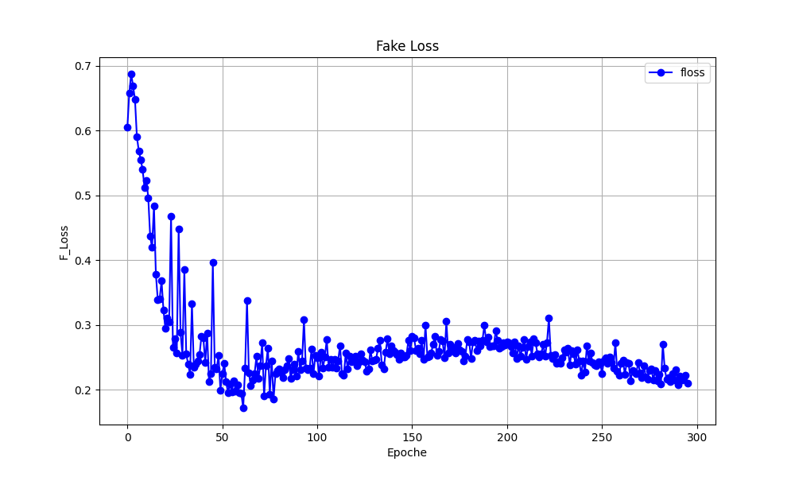
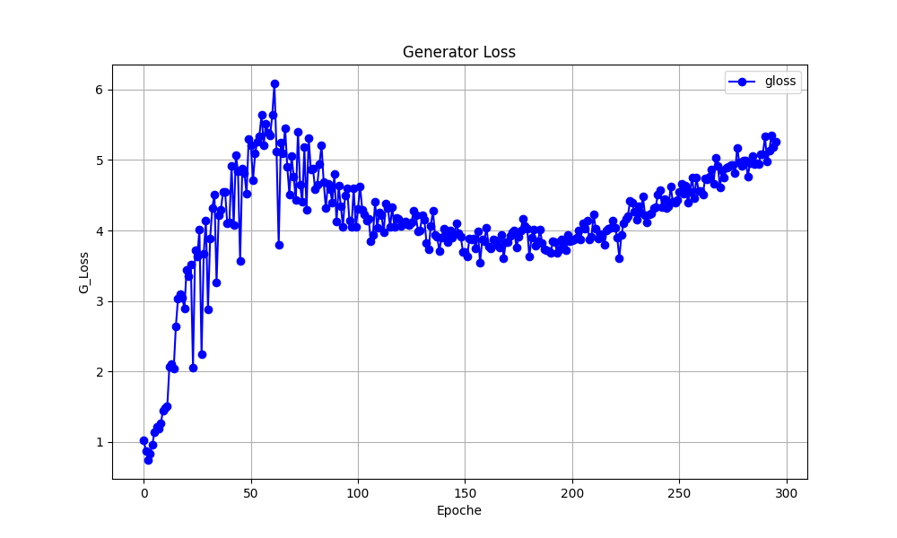
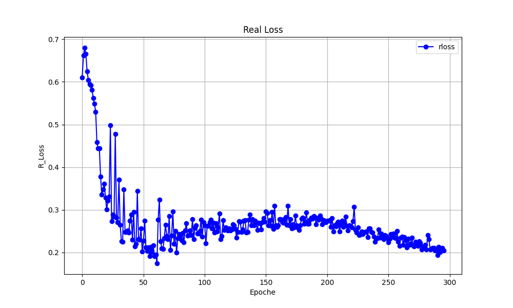
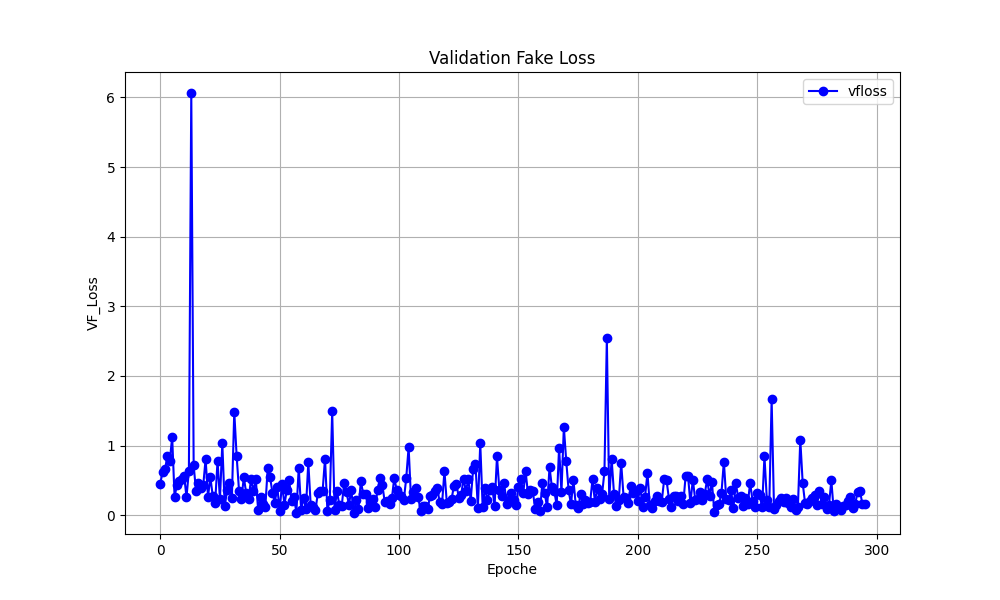
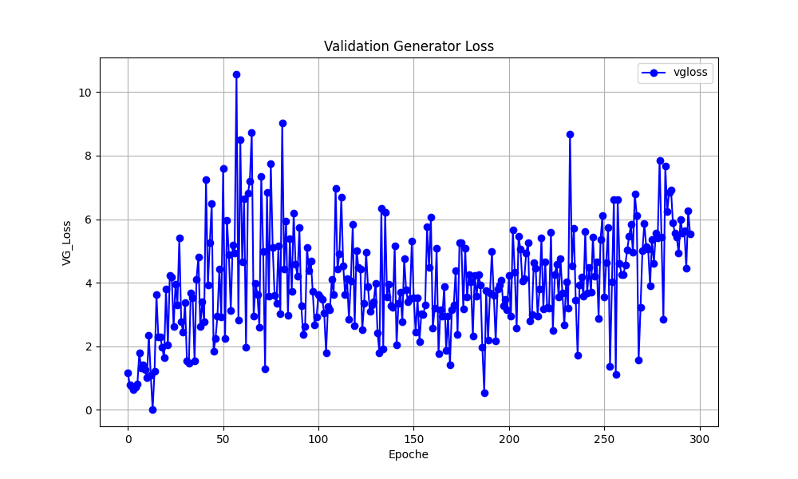
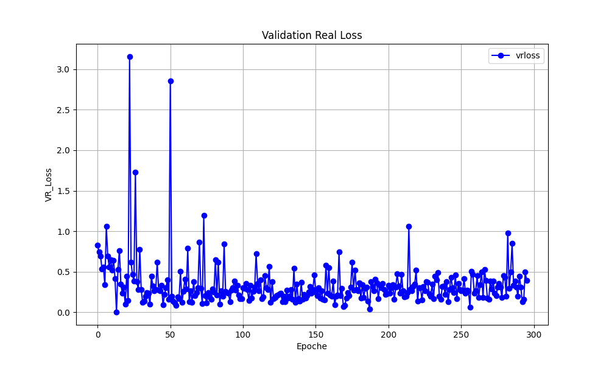

# GAN-based Image Inpainting

**Image inpainting** is the task of reconstructing missing or corrupted regions of an image in a way that is visually coherent with the surrounding content. It has practical applications in photo restoration, object removal, and content-aware editing — anywhere a damaged or incomplete image needs to be filled in plausibly.

This project implements a GAN-based solution to the problem: given a landscape image with a black rectangular patch masking a portion of it, the network learns to reconstruct the hidden region. The approach is fully adversarial — a **Generator** (Encoder-Decoder) learns to produce realistic completions, while a **Discriminator** (binary classifier) pushes it to generate images indistinguishable from real ones.

The mask position within the image is randomized at each batch, but kept consistent across all samples in the same batch. The model was trained and evaluated on a dataset of over 4,000 landscape photographs spanning mountains, coastlines, forests, and cities.

---

## Demo — Best Model Results

| Masked input | Reconstructed output |
|:-:|:-:|
|  |  |

---

## Architecture

The GAN consists of two networks trained adversarially:

```
 Masked Image (128×128×4)
         │
         ▼
  ┌─────────────┐        fake image        ┌──────────────────┐
  │  Generator  │ ───────────────────────▶ │  Discriminator   │──▶  Real / Fake
  │  Enc-Dec    │                          │  Classifier      │
  └─────────────┘                          └──────────────────┘
                                                    ▲
                                           real image (128×128×3)
```

### Generator — Encoder-Decoder
- Input: masked image `128×128×4` (RGB + binary mask channel)
- Each encoder block: Conv2D → BatchNorm → ReLU → MaxPooling → Residual Block
- Decoder: transposed convolutions to reconstruct the original resolution
- Output: reconstructed image `128×128×3`

### Discriminator — Classifier
- Input: image `128×128×3` (real or generated)
- Each block: Conv2D → LeakyReLU
- Output: binary classification (real / fake)

---

## Training — Loss Curves (Best Model)

| Discriminator Losses | Generator Losses |
|:-:|:-:|
|  |  |
|  | |

| Val Fake Loss | Val Generator Loss | Val Real Loss |
|:-:|:-:|:-:|
|  |  |  |

---

## Experiments & Results

7 training runs were performed varying learning rate, batch size, and optimizer. Full results:

| # | Learning Rate | Optimizer | Batch Size | Epochs | FID ↓ | PSNR ↑ |
|---|:-:|:-:|:-:|:-:|:-:|:-:|
| **1 ⭐** | **1e-4** | **Adam** | **16** | **300** | **95.52** | **71.28** |
| 2 | 1e-4 | Adam | 8 | 300 | 154.8 | 69.08 |
| 3 | 1e-4 | Adam | 32 | 300 | 155.2 | 70.14 |
| 4 | 1e-4 | Adam | 64 | 300 | 236.3 | 68.71 |
| 5 | 1e-4 | RMSprop | 16 | 300 | 141.9 | 68.03 |
| 6 | 1e-4 | SGD | 16 | 300 | 270.0 | 68.03 |
| 7 | 1e-5 | Adam | 16 | 400 | 157.0 | 71.26 |
| 8 | 1e-3 | Adam | 16 | 300 | — | — |

**Best configuration:** `lr=1e-4`, `Adam`, `batch_size=16`, `300 epochs` → FID: 95.52 / PSNR: 71.28

### Key findings
- **Learning rate** of `1e-4` provided the best balance between convergence speed and stability. `1e-3` caused training collapse; `1e-5` was too slow.
- **Batch size** of `16` was optimal. Larger batches (64) caused instability; smaller ones (8) introduced excessive noise.
- **Adam** outperformed both SGD (FID: 270) and RMSprop (FID: 170.9) by a large margin.
- **Reconstruction Loss + Adversarial Loss** combination was tested but discarded — pure Adversarial Loss produced better results.
- **Contextual Attention** module was explored but abandoned due to prohibitive computational cost.

---

## 📁 Project Structure

```
.
├── Best_model/
│   ├── plots/                   # Loss curves (train + val) of the best model
│   │   ├── FakeLoss.png
│   │   ├── GeneratorLoss.png
│   │   ├── RealLoss.png
│   │   ├── ValFakeLoss.png
│   │   ├── ValGeneratorLoss.png
│   │   └── ValRealLoss.png
│   ├── Test Empty Patch.png     # Test input (masked)
│   └── Test Filled Patch.png  # Test output (reconstructed)
├── models/
│   ├── patch_generator.pkl      # Trained generator weights
│   └── stroke_generator.pkl
├── Report/
│   └── Report_ML.pdf            # Full project report
├── constants.py                 # Hyperparameters
├── dataset.py                   # Dataset loading & preprocessing
├── discriminator.py             # Discriminator architecture
├── generator.py                 # Generator architecture
├── train.py                     # Training script
├── test.py                      # Inference script
└── prova_colab.ipynb            # Google Colab notebook
```

---

## 🚀 Getting Started

### 1. Clone the repository

```bash
git clone https://github.com/LuigiMaggipinto23/Machine-Learning-Model-GAN_NN-Image-Inpainting
cd Machine-Learning-Model-GAN_NN-Image-Inpainting
```

### 2. Install dependencies

```bash
pip install torch torchvision numpy matplotlib pillow
```

### 3. Download the dataset

The dataset is not included in the repo due to its size (~4300 landscape images). Download it from Kaggle:

[arnaud58/landscape-pictures](https://www.kaggle.com/datasets/arnaud58/landscape-pictures)

Create the folder `dataset/` and put the images in this folder following the split below:

```
dataset/
├── training/    # 70% — 3023 images
├── val/         # 15% —  648 images
└── test/        # 15% —  648 images
```

### 4. Train

```bash
python train.py
```

Hyperparameters (learning rate, batch size, epochs, etc.) are configured in `constants.py`.

### 5. Test

```bash
python test.py
```

### 6. Run on Google Colab

Open `prova_colab.ipynb` directly in Colab for a no-setup experience.

---

## Configuration

Key hyperparameters in `constants.py`:

| Parameter | Best value | Description |
|---|:-:|---|
| `LEARNING_RATE` | `1e-4` | Adam learning rate |
| `BATCH_SIZE` | `16` | Training batch size |
| `EPOCHS` | `300` | Number of training epochs |
| `IMG_SIZE` | `128` | Input image resolution |
| `OPTIMIZER` | `Adam` | Optimizer |

---

## Evaluation Metrics

- **FID (Fréchet Inception Distance)** — measures similarity between generated and real image distributions. Lower is better; ideal target is below 50.
- **PSNR (Peak Signal-to-Noise Ratio)** — measures pixel-level reconstruction quality in dB. Higher is better; values above 30 dB are generally considered good.

---

## Report

The full technical report (architecture details, ablation studies, metric analysis) is available in [`Report/Report_ML.pdf`](Report/Report_ML.pdf).
